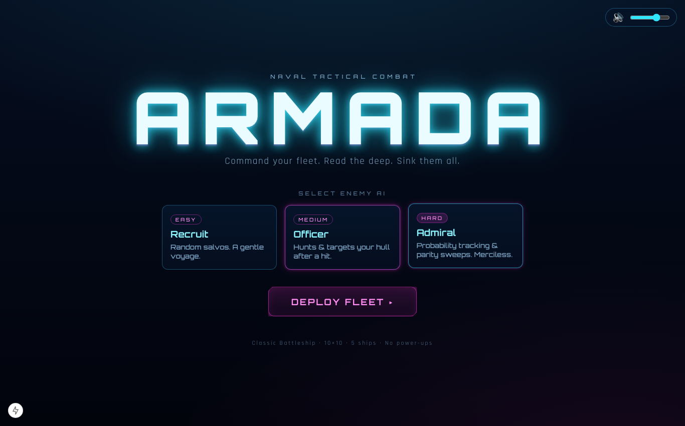
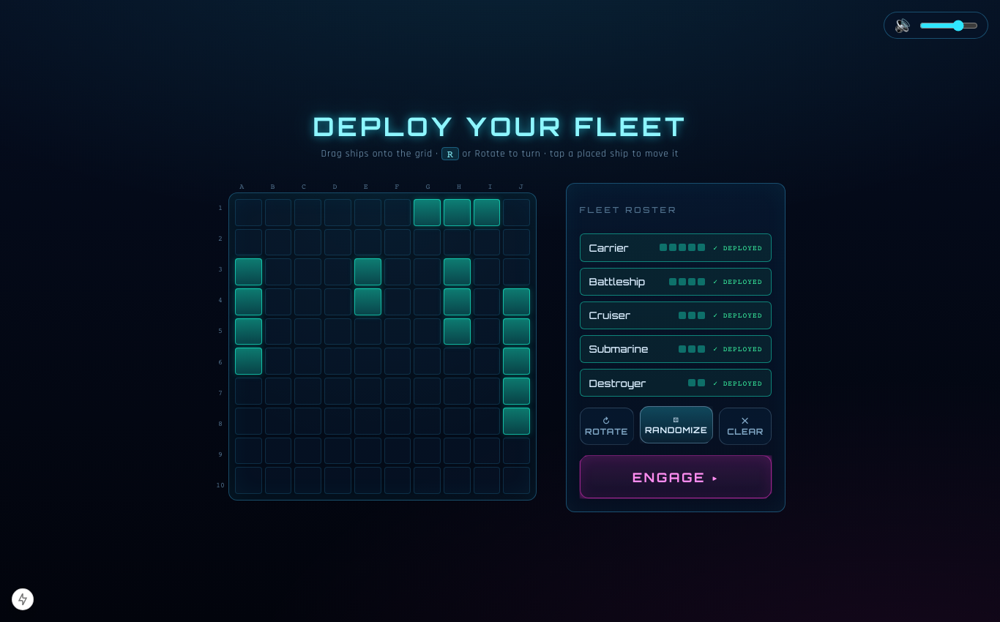
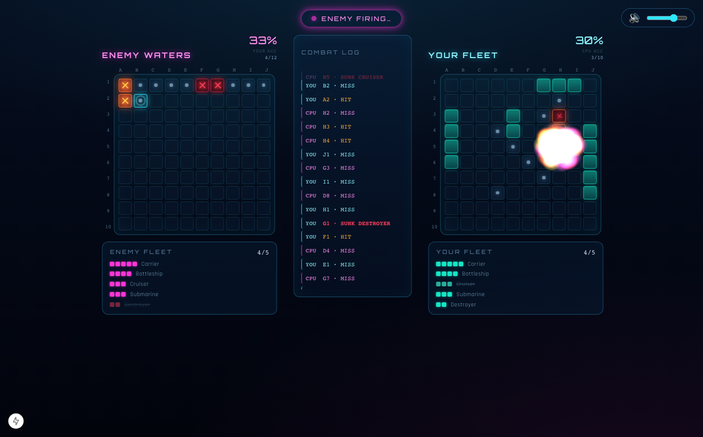
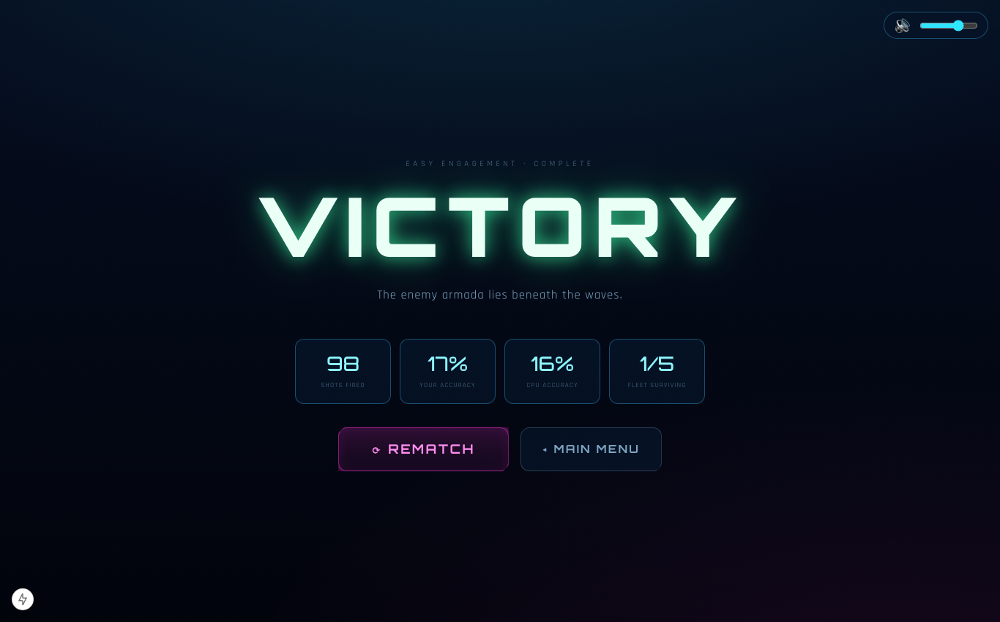
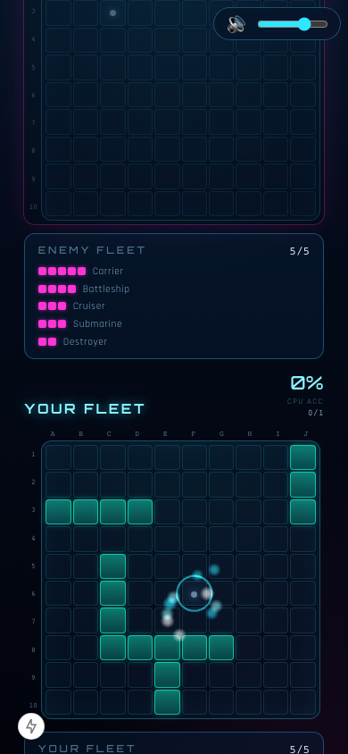

# ⚓ ARMADA

**A cinematic, single-player Battleship game with a modern naval sci-fi soul.**
Holographic grids, a neon HUD, synthesized combat audio, juicy particle FX, and a three-tier AI that will actually outsmart you. Pure classic Battleship rules — all the wow is in the presentation.

[](https://vercel.com/new/clone?repository-url=https://github.com/ijehdude/Battleship)



---

## ✨ Features

- **Pure classic Battleship** — 10×10 grids, the standard 5-ship fleet (Carrier 5, Battleship 4, Cruiser 3, Submarine 3, Destroyer 2). No power-ups, no gimmicks in the rules.
- **Three AI difficulties**
  - **Recruit (Easy)** — random salvos.
  - **Officer (Medium)** — hunt/target: after a hit it probes adjacent cells and tracks the ship along its axis.
  - **Admiral (Hard)** — probability-density targeting with parity hunting. It builds a heat map of where ships can still fit and fires at the most likely cell. It is merciless.
- **Drag-and-drop placement** — pointer + touch, with **rotate** (button or `R`), **Randomize**, **Clear**, and live valid/invalid placement preview.
- **Game feel / juice** — particle explosions, expanding impact rings & shockwaves, screen shake, water-splash on misses, animated hit/miss/sunk markers, consecutive-hit **streak** flair, and a **slow-mo killing-blow cinematic** before the result screen.
- **Neon HUD** — turn indicator, per-fleet ship trackers, live accuracy stats, and a scrolling combat log.
- **Synthesized audio** — every SFX (cannon fire, explosion, splash, ship-sunk klaxon, UI, victory/defeat stingers) and the ambient music bed are generated at runtime with the Web Audio API. **Zero audio asset files, zero licensing concerns.** Mute toggle + volume slider (persisted), audio unlocked on first interaction per autoplay policy.
- **Fully responsive** — side-by-side grids on desktop, stacked on mobile; tap-to-fire and drag-to-place. No reliance on hover for core gameplay.
- **Accessible** — full keyboard play (arrow keys to move the targeting reticle, Enter/Space to fire), visible focus states, ARIA labels, and `prefers-reduced-motion` support that disables heavy FX and the slow-mo.
- **Tested game logic** — framework-agnostic core with **22 unit tests** covering hit detection, the win condition, ship placement validation, and AI targeting.

## 🖼️ Screenshots

| Deploy your fleet | Battle |
| --- | --- |
|  |  |

| Victory | Mobile |
| --- | --- |
|  |  |

> _Replace these with a recorded GIF for the full effect — the explosions, shake, and slow-mo don't show in stills!_

## 🧱 Tech stack & rationale

| Concern | Choice | Why |
| --- | --- | --- |
| Framework | **Next.js 15 (App Router) + React 19** | Vercel-native, zero-config deploy, fast static export of a single client app. |
| Language | **TypeScript (strict)** | Typed domain model; game logic is fully type-checked. |
| FX rendering | **PixiJS 8 (WebGL)** | Particle bursts, rings, shockwaves and screen shake at a buttery 60fps — even on mobile. It's **dynamically imported**, so it stays out of the initial bundle (first load ≈ **108 kB**) and only downloads when the canvas mounts. |
| Interactive grid | **DOM + CSS** | Crisp, accessible, keyboard-navigable cells layered over the Pixi FX canvas — the best of both: a11y from the DOM, juice from WebGL. |
| Animation | **GSAP** | Elastic DOM shake and tweened transitions. |
| State | **Zustand** | Tiny, fast store driving the `menu → placement → battle → result` state machine, cleanly separated from rendering. |
| Audio | **Web Audio API (hand-rolled synth)** | No asset files to license, host, or load. |
| Tests | **Vitest** | Fast unit tests for the pure game core (Node environment, no DOM needed). |

**Architecture** — game logic lives in [`src/game/`](src/game) and imports *nothing* from React, Pixi, or the browser, so it's trivially unit-testable. The Zustand store in [`src/state/`](src/state) is the state machine. React components in [`src/components/`](src/components) render the UI; PixiJS ([`FxLayer`](src/components/FxLayer.tsx)) and Web Audio ([`src/audio/`](src/audio)) are pure presentation reacting to store events.

```
src/
  game/        pure, tested domain logic (board, ships, AI, rng) + *.test.ts
  state/       Zustand store / phase state machine
  components/  Menu, Placement, Battle, Result, Grid, Hud, FxLayer, Game
  audio/       Web Audio synth engine
  hooks/       useAudio, useReducedMotion
  styles/      game component styles
  app/         Next.js App Router (layout, page, global tokens)
```

## 🚀 Local development

Requires **Node ≥ 18.18** (Node 20+ recommended).

```bash
npm install
npm run dev        # http://localhost:3000
```

Other scripts:

```bash
npm run build      # production build
npm start          # serve the production build
npm test           # run the unit tests (Vitest)
npm run typecheck  # tsc --noEmit
npm run lint       # next lint
```

## ▲ Deploy to Vercel

### Option A — Dashboard (one click)

1. Push this repo to GitHub (already wired to `origin`).
2. Go to **[vercel.com/new](https://vercel.com/new)** and **Import** the `Battleship` repository.
3. Framework preset is detected as **Next.js** automatically. Leave the defaults:
   - **Build command:** `next build`
   - **Install command:** `npm install`
   - **Output directory:** `.next`
4. Click **Deploy**. That's it — no environment variables required.

Or just click the button: [](https://vercel.com/new/clone?repository-url=https://github.com/ijehdude/Battleship)

### Option B — Vercel CLI

```bash
npm i -g vercel
vercel            # preview deploy (follow the prompts)
vercel --prod     # production deploy
```

A [`vercel.json`](vercel.json) is included pinning the Next.js framework preset and build settings, so both paths are zero-config.

## 🎮 How to play

1. **Menu** — pick an AI difficulty, hit **Deploy Fleet**.
2. **Placement** — drag ships onto your grid (or **Randomize**). Press **R** or the rotate button to turn the held ship. Tap a placed ship to pick it back up. When all 5 are down, hit **Engage**.
3. **Battle** — click/tap a cell in **Enemy Waters** to fire. Hits let you fire again; a miss passes the turn. Sink the entire enemy fleet before they sink yours.
4. **Result** — review your stats, then **Rematch** or return to the **Main Menu**.

**Keyboard:** arrow keys move the targeting reticle, **Enter/Space** fires, **R** rotates during placement.

## 🔊 Audio & asset licensing

All sound effects and the background music are **synthesized in-code** with the Web Audio API ([`src/audio/engine.ts`](src/audio/engine.ts)) — there are **no bundled audio files**, so there is nothing to license. Fonts (Orbitron, Rajdhani) are loaded via `next/font` from Google Fonts (Open Font License).

## 🧪 Testing

```bash
npm test
```

Covers ship placement & bounds validation, hit/miss/sunk resolution, the win condition, that the AI never repeats a shot, medium hunt/target behavior, and that the hard AI's probability hunting reliably sinks a fleet well under the 100-cell budget.

---

Built with care for smooth animation and game feel. Fair winds, Admiral. ⚓
